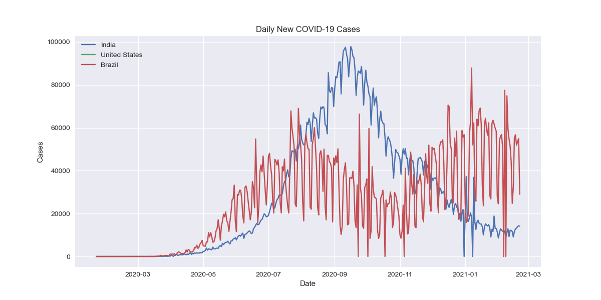
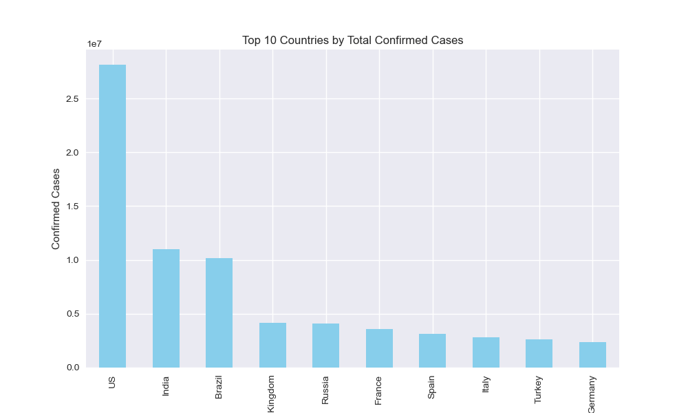
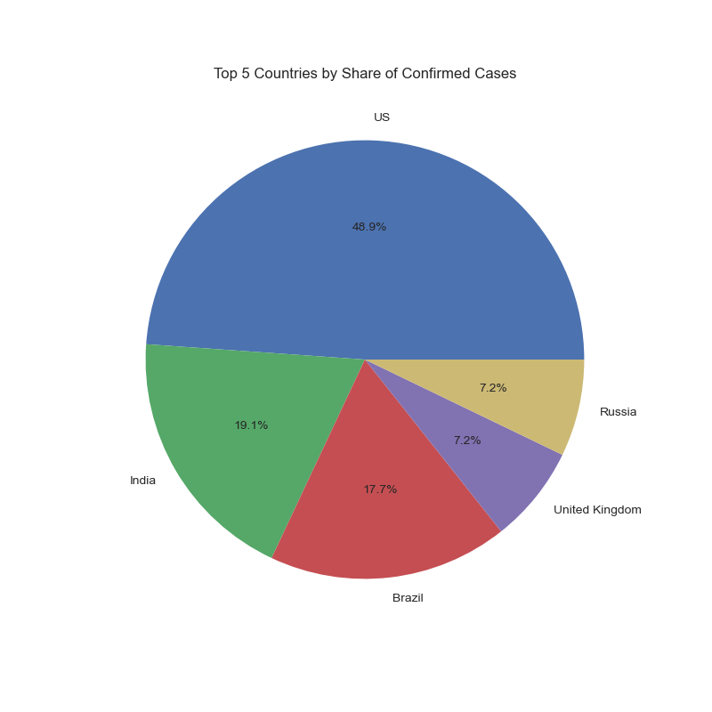
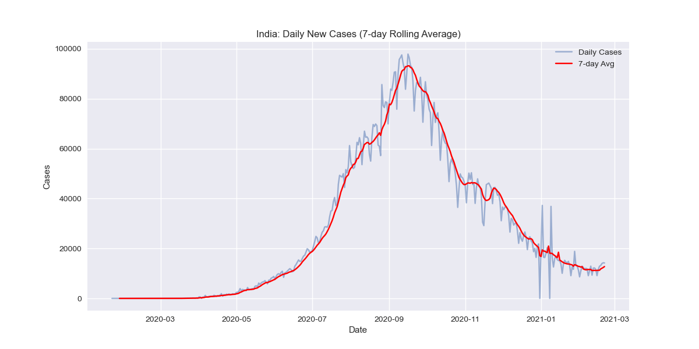

# 📊 COVID-19 Data Analysis with NumPy, Pandas, and Matplotlib

## 🔎 Overview
This project analyzes the **COVID-19 global dataset** from Johns Hopkins University using **NumPy, Pandas, and Matplotlib**.  
The dataset is reshaped, cleaned, and visualized to uncover trends such as daily new cases, rolling averages, and top countries by confirmed cases.  

The project demonstrates **data wrangling + exploratory data analysis (EDA) + visualization** without advanced ML libraries.

---

## 🛠 Tech Stack
- **NumPy** → Numerical operations & statistics  
- **Pandas** → Data cleaning, manipulation, and reshaping  
- **Matplotlib** → Visualizations and saving plots as PNG  

---

## 📂 Dataset
Dataset: **Johns Hopkins CSSE COVID-19 Time Series**  
- [`time_series_covid19_confirmed_global.csv`](https://raw.githubusercontent.com/CSSEGISandData/COVID-19/master/csse_covid_19_data/csse_covid_19_time_series/time_series_covid19_confirmed_global.csv)  

Format:  
- Columns: `Province/State`, `Country/Region`, `Lat`, `Long`, daily confirmed cases (e.g., `1/22/20`, `1/23/20`, …).  

---

## 📂 Project Structure
```

Covid19-data-analysis-numpy-pandas-matplotlib/
│── README.md                  # Project documentation
│── covid19_analysis.ipynb     # Jupyter notebook with code + EDA
│── time_series_covid19_confirmed_global.csv   # Input dataset
│── output/                    # Folder containing generated PNG plots
│   ├── daily_new_cases.png
│   ├── top10_countries.png
│   ├── top5_pie.png
│   └── india_rolling_avg.png

````

---

## 🚀 Getting Started

### 1️⃣ Clone the Repository
```bash
git clone https://github.com/avinash-kamble-9/Covid19-data-analysis-numpy-pandas-matplotlib.git
cd Covid19-data-analysis-numpy-pandas-matplotlib
````

### 2️⃣ Install Requirements

```bash
pip install numpy pandas matplotlib
```

### 3️⃣ Run the Jupyter Notebook

```bash
jupyter notebook
```

Open `covid19_analysis.ipynb` and run the cells.
All plots will be saved into the **`output/`** folder.

---

## 📊 Visualizations

### 1. Daily New Cases (India, USA, Brazil)



### 2. Top 10 Countries by Total Cases



### 3. Share of Cases Among Top 5 Countries



### 4. India: 7-Day Rolling Average



---

## 📢 Insights

* The United States, India, and Brazil had the **highest cumulative cases**.
* **Daily new cases** reveal distinct pandemic waves.
* **7-day rolling averages** smooth daily fluctuations for better trend analysis.
* A **small number of countries** dominate global case counts.

---

## 👨‍💻 Author

**Avinash**
🔗 [LinkedIn](https://www.linkedin.com/in/avinashzz)
